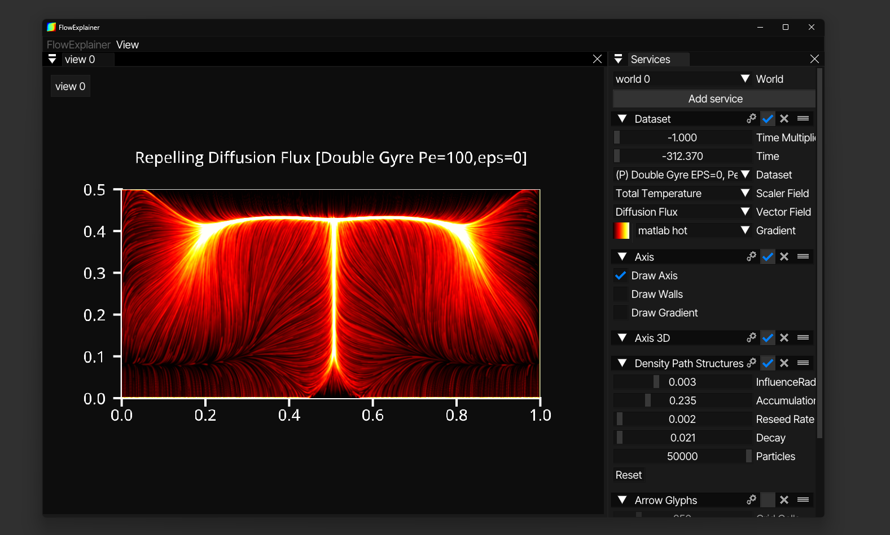

# FlowExplainer

A C# framework for visualizing heat flow using Lagrangian Coherent Structures (LCS) and flow based visualizations techniques. 

**Note:** This project is actively being developed as part of my PhD research but not yet in a state to be used in any production context.
